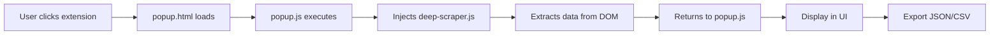
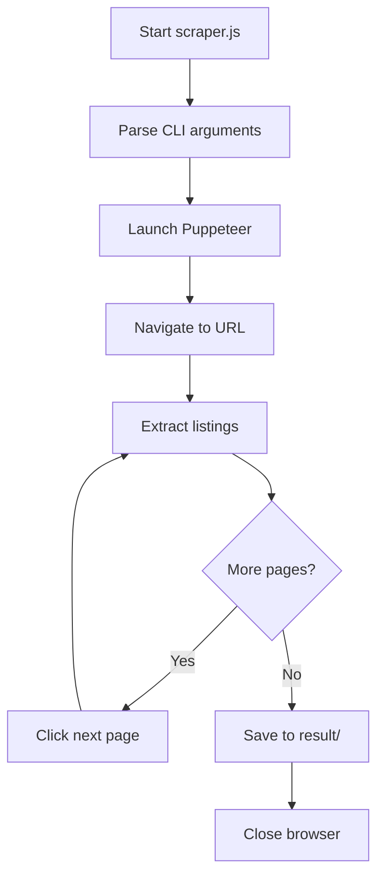

# Architecture Overview

## Project Purpose

**PagesJaunes Scraper by TiwiTiw** is a professional data extraction tool designed to scrape business listings from PagesJaunes.fr. It offers two deployment modes:

1. **Chrome Extension** - User-friendly browser interface for manual scraping
2. **Standalone Scraper** - Automated Puppeteer-based script for server deployment

## Directory Structure

```
pj_chrome_ext/
├── ext/                    # Chrome Extension
│   ├── icons/             # Extension icons (16x16 to 128x128)
│   ├── manifest.json      # Chrome extension manifest (v3)
│   ├── popup.html         # Extension popup UI
│   ├── popup.js           # UI logic and data export
│   ├── background.js      # Service worker
│   ├── content.js         # Content script injector
│   ├── deep-scraper.js    # Original scraping logic
│   └── deep-scraper-v2.js # Enhanced scraping logic
├── test/                   # Test files (future)
├── docs/                   # Documentation
│   ├── ARCHITECTURE.md    # This file
│   ├── USAGE.md           # Usage guide
│   ├── DEPLOYMENT.md      # Deployment instructions
│   └── TROUBLESHOOTING.md # Common issues
├── html/                   # HTML samples for testing
│   └── samples/           # Saved PagesJaunes pages
├── result/                 # Scraper output directory
├── scripts/                # Utility scripts
│   ├── create_icons.py    # Icon generator
│   └── resize_icons.py    # Icon resizer
├── scraper.js              # Standalone Puppeteer scraper
├── package.json            # Node.js dependencies
├── deploy.sh               # Linux deployment script
└── README.md               # Main documentation
```

## Chrome Extension Architecture

### Manifest V3 Structure

The extension uses Chrome's Manifest V3 with the following components:

- **Service Worker** (`background.js`) - Handles extension lifecycle
- **Content Scripts** (`content.js`) - Injects scraping logic into PagesJaunes pages
- **Popup UI** (`popup.html/js`) - User interface for data extraction and export
- **Deep Scrapers** - Two versions of scraping logic with different extraction strategies

### Data Flow



### Permissions

- `scripting` - Inject content scripts
- `activeTab` - Access current tab
- `downloads` - Export files
- `storage` - Save user preferences

## Standalone Scraper Architecture

### Puppeteer-Based Automation

The standalone scraper (`scraper.js`) uses Puppeteer to:

1. Launch headless Chrome browser
2. Navigate to PagesJaunes search results
3. Extract business listings from each page
4. Handle pagination automatically
5. Optionally reveal phone numbers by clicking buttons
6. Export results to JSON and CSV

### Data Flow



### Command-Line Interface

```bash
node scraper.js <URL> [options]
  --max-pages <N>      # Number of pages to scrape
  --page-delay <MS>    # Delay between pages
  --reveal-phones      # Click to reveal phone numbers
  --output <DIR>       # Output directory
```

## Data Extraction Strategy

### Business Listing Fields

Both the extension and standalone scraper extract:

- **Name** - Business name
- **Address** - Full address
- **Phone** - Phone number (revealed or hidden)
- **Website** - Website URL
- **Categories** - Business categories
- **Rating** - User rating (if available)
- **Reviews** - Number of reviews
- **Hours** - Opening hours
- **GPS Coordinates** - Latitude/longitude

### DOM Selectors

The scrapers use CSS selectors to target specific elements on PagesJaunes pages. These selectors are maintained in the deep-scraper scripts.

## Technology Stack

### Chrome Extension
- **HTML/CSS** - UI
- **Vanilla JavaScript** - Logic
- **Chrome Extension API** - Browser integration

### Standalone Scraper
- **Node.js** - Runtime
- **Puppeteer** - Browser automation
- **CSV generation** - Built-in Node.js modules

### Utilities
- **Python** - Icon generation scripts
- **Bash** - Deployment automation

## Output Format

### JSON Structure

```json
[
  {
    "name": "Business Name",
    "address": "123 Street, City",
    "phone": "+33 1 23 45 67 89",
    "website": "https://example.com",
    "categories": ["Category1", "Category2"],
    "rating": 4.5,
    "reviews": 42,
    "hours": "Mon-Fri: 9-18",
    "gps": {"lat": 48.8566, "lng": 2.3522}
  }
]
```

### CSV Structure

Flat structure with columns for each field, arrays converted to comma-separated strings.

## Deployment Models

### Local Development
- Chrome extension loaded unpacked
- Standalone scraper run from command line

### Production (Linux Server)
- Standalone scraper deployed via `deploy.sh`
- Automated via cron jobs
- Results stored in `result/` directory

## Future Enhancements

- Unit tests in `test/` directory
- Proxy rotation for anti-bot evasion
- Database integration
- API endpoint for remote scraping
- Real-time monitoring dashboard
